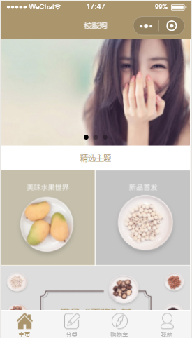
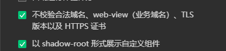
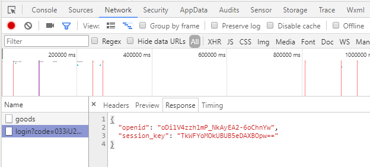

~~go语言做后端进行微信小程序开发~~

~~刚开始～~~  
替换conf/app.conf中appid,secret  
替换wechatapp/yq_shop/app.js中`domain: 'http://192.168.31.105:8009'`为你自己的ip  

运行图：  
  

配置:  
  

接口访问形式：  

ps : 建议用gin框架开发[接口api](https://github.com/dreamlu/deercoder-gin)，好用点
